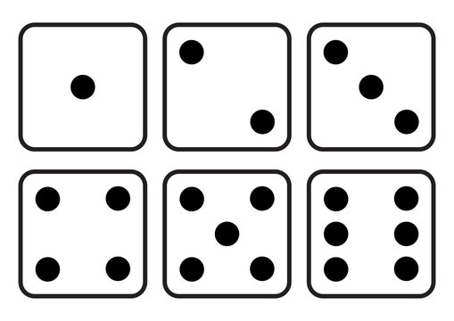

# Dice App
Build a dice simulator using jQuery.

This entire project should be built using jsbin and **only work in the HTML section.** When you are done, save your project and send the unique URL to your instructor.

# Part 1: Create the Die

## TODO 1: Create the die element with HTML and CSS

Inside the `<body>`, add a `<div id='die'>` element.

Then, inside the `<head>`, add `<style>` tags and the CSS styles below

```html
<style>
    #die {
        height: 100px;
        width: 100px;
        background-color: lightgray; /* feel free to change this */
        position: relative;
    }
</style>
```

## TODO 2: Import jQuery

Inside the `<head>`, copy-paste the HTML `<script>` tag to import jQuery.

```html
<script src="https://code.jquery.com/jquery-3.5.1.js"></script>
```

## TODO 3: Create a dot in the die with jQuery

_After_ the `</body>`, add opening and closing `<script>` tags.

_Inside_ the script tags, use jQuery to create a single dot in the middle of the #die element:

```js
$('<div>')
    .css("height", 15)
    .css("width", 15)
    .css("background-color", "black")
    .css("position", "absolute")
    .css('top', 50)
    .css('left', 50)
    .appendTo("#die");
```  
 
 
# Part 2: Make your code reusable.

## TODO 4: Create a function to make a dot anywhere

Turn your code from TODO 3 into a function that can make a dot in ANY LOCATION. What parameters should this function have? What will change each time you create a new dot?

Name this function `makeDot`.

**Note:** rather than using the parameters to set the positions of the dot, use the parameters and subtract 10 from each of them. This will center things better. This is not required for full credit, however.

# Part 3: Make it random!

## TODO 5: Generate a random number

Use the code below to generate a random number between 1 and 6 each time the program runs:

```js
var randomNum = Math.ceil(Math.random() * 6)
```

## TODO 6: Display the correct number of dots

Use `if` statements to create the correct number of dots based on the random number. Use the image and code below for guidance.



You only need to program in the case of six dots. For the rest, simply copy in this code (be sure to replace `dieID` with your actual die id):

```js
if (randomNum === 1) {
    makeDot(50, 50, dieID); // middle middle
}
else if (randomNum === 2) {
    makeDot(25, 25, dieID); // top left
    makeDot(75, 75, dieID); // bottom right
}
else if (randomNum === 3) {
    makeDot(25, 25, dieID); // top left
    makeDot(75, 75, dieID); // bottom right
    makeDot(50, 50, dieID); // middle middle
}
else if (randomNum === 4) {
    makeDot(75, 75, dieID); // bottom right
    makeDot(25, 25, dieID); // top left
    makeDot(25, 75, dieID); // bottom left
    makeDot(75, 25, dieID); // top right
}
else if (randomNum === 5) {
    makeDot(50, 50, dieID); // middle middle
    makeDot(75, 75, dieID); // bottom right
    makeDot(25, 25, dieID); // top left
    makeDot(25, 75, dieID); // bottom left
    makeDot(75, 25, dieID); // top right
}
```

Using both the image and the code above, you should be able to figure out the case for six dots. Put it in!

# Part 4: Make it clickable

## TODO 7: Make it a function

Make a function called `rollDie` and put your all your code from Part 3 (TODOs 5 and 6) into that function. You will also want to add the following line to the beginning of the function:

    $('#die').empty();

You will also want to give `rollDie` a single parameter of `dieID` in case you attempt the challenge later.

Now, just calling the function will roll the die!

## TODO 8: Run on clicks!

Make your die clickable by registering an event handler function to respond to a `"click"` event. Use the general structure below:

```js
// Register an event handler function to be called in response to an "event"
$("element").on("eventType", handlerFn);

// Event handler function
function handlerFn() {

}
```

You will need to put your function call to `rollDie()` in your handler function, of course, or else the handler function won't do anything!

# Bonus Challenge

Add a second die that would produce a different result from the first.

**HINT:** Make your `rollDie` function take in an element's id so you can specify which die to roll for. Then you'll just need to call the function once for each die you roll!
